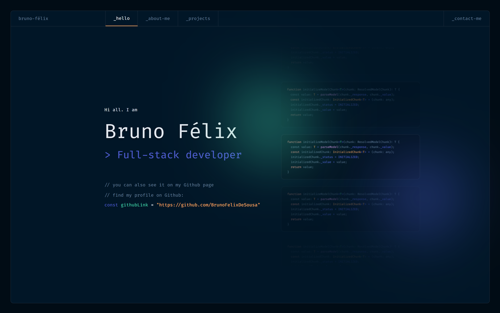

# Bruno Félix - Site Pessoal

Este projeto é o meu próprio site pessoal, um lugar projetado para compartilhar minha jornada como desenvolvedor full-stack.

<!-- Aqui, além de oferecer uma visão detalhada sobre mim, incluindo minha formação, experiência e habilidades, também destaco alguns dos projetos nos quais tenho trabalhado. -->

Este site não apenas serve como um portfólio, mas também como uma maneira de demonstrar meu estilo de codificação e abordagem para resolver problemas. Sinta-se à vontade para explorar meu trabalho e entrar em contato comigo para colaborações, oportunidades ou simplesmente para trocar ideias sobre desenvolvimento de software.


## Screenshot

Aqui está uma captura de tela do projeto:




## Tecnologias Utilizadas

- HTML
- CSS
- Javascript


## Instruções de Uso

1. Faça o clone deste repositório.
   ```bash
   git clone https://github.com/BrunoFelixDeSousa/bruno-felix-portfolio.git
   ```

2. Abra o arquivo `index.html` em seu navegador para visualizar a Landing Page.

<!-- ## Contribuições

[Guia para contribuições, incluindo informações sobre como relatar problemas, propor melhorias e enviar pull requests.]

1. Faça um Fork do projeto
2. Crie uma branch para sua feature (`git checkout -b feature/sua-feature`)
3. Faça commit das suas mudanças (`git commit -m 'Adiciona nova feature'`)
4. Faça push para a branch (`git push origin feature/sua-feature`)
5. Abra um Pull Request -->

## Licença

Este projeto está licenciado sob a licença MIT. Consulte o arquivo [LICENSE](LICENSE) para obter mais informações.

## Créditos

Este projeto foi desenvolvido utilizando o template do Figma <a href="https://www.figma.com/community/file/1100794861710979147" target="_blank"> Portfolio for Developers Concept V.2</a>, desenvolvido por <a href ="https://www.behance.net/darelova" target="_blank">@darelova</a>